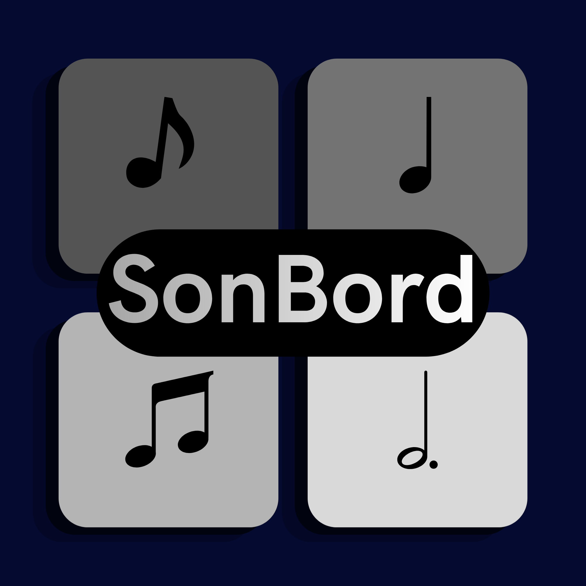

  
  <h1>SonBord</h1>
  
Open‑source sound board for Android

---

## About the project

SoundPad is a minimal, open‑source sound board app built for Android, with a clean, Material‑You‑inspired design. The goal is to provide a simple way to store and trigger custom sounds and playlists using pads directly from your device, with no bloat and no tracking.

In the future, the app may be extended to support iOS as well, keeping the same core idea: a lightweight, color‑coded sound pad that feels native and responsive on both platforms.a 

---

## Key features

- Launch custom sound clips (MP3, MP4, and other supported formats).  
- Use colored pads to visually group sounds by category.  
- Assign and control external or custom playlists.  
- Loop sounds on command, with a simple toggle for one‑shot vs continuous playback.  
- Light and dark themes, with Material You‑style styling where supported.  
- Completely open source and community‑driven.

---

## Scope and limitations

This project focuses on building a **simple, hackable sound board**, not a full‑featured media player or DAW. Core priorities include:
- Performance on older devices.  
- Accessibility and ease of use.  
- Clean, readable UI that works on both phones and tablets.  
- A foundation that could later be shared or adapted for iOS via a cross‑platform backend or shared logic.

If you want to extend the app (e.g., add cloud sync, community presets, or advanced audio effects), contributions are welcome.

---

## Usage

1. Import your sounds into the app via the library or file picker.  
2. Assign each sound to a pad and choose a color label.  
3. Optionally link a playlist to a pad.  
4. Play sounds with a single tap; long‑press to edit or loop.

The UI is kept minimal so you can focus on the sounds, not the menus.

---

## Contributing

This is an open‑source project. If you want to:
- improve the UI,  
- add new features,  
- fix bugs, or  
- help port the app to iOS in the future,

please open an issue or a pull request. The project is intentionally kept simple so newcomers can understand the codebase quickly.

---

## License

SoundPad is open source and licensed under the **GPL‑3.0**. See the `LICENSE` file for details.

---

## Future roadmap

- Polish Material‑You‑style theming for Android.  
- Add support for tablet layouts and adaptive UI.  
- Improve sound‑organization features (tags, folders, filters).  
- Investigate a shared codebase or backend for a possible iOS version.  
- Allow community‑shared preset packs and color schemes.

---
